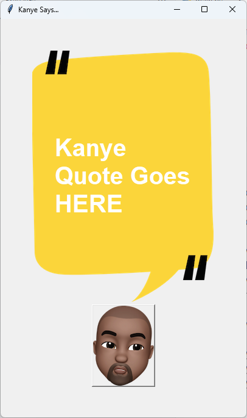

Certainly! Here's a more polished and professional version of the `README.md` file with emojis to make it visually appealing:

# � Kanye Quotes

A simple and fun Python application that displays random quotes from Kanye West using the `tkinter` library and the [Kanye.rest](https://kanye.rest/) API.



## ✨ Features

- 🎤 Fetches a random Kanye West quote from the Kanye.rest API.
- 🖼️ Displays the quote in a clean and user-friendly GUI.
- 🎨 Click the Kanye button to get a new quote instantly.

## 📋 Requirements

- Python 3.x
- `requests` library
- `tkinter` library (usually comes pre-installed with Python)

## 🛠️ Installation

1. **Clone the repository**:
   ```bash
   git clone https://github.com/masood2004/kanye-quotes.git
   cd kanye-quotes
   ```

2. **Install the required dependencies**:
   ```bash
   pip install requests
   ```

3. **Run the application**:
   ```bash
   python main.py
   ```

## 🚀 Usage

1. Launch the application by running:
   ```bash
   python main.py
   ```

2. The application window will open, displaying a random Kanye West quote.

3. Click the **Kanye button** to fetch and display a new quote.

## 📂 Project Structure

- `main.py`: The main script that runs the application.
- `background.png`: The background image for the GUI.
- `kanye.png`: The image of Kanye West used for the button.
- `README.md`: This file, providing an overview of the project.

## 🤝 Contributing

Contributions are welcome! If you have any suggestions, improvements, or bug fixes, feel free to open an issue or submit a pull request. Please follow the [contribution guidelines](CONTRIBUTING.md) (if available).

## 📜 License

This project is licensed under the **MIT License**. See the [LICENSE](LICENSE) file for more details.

## 🙏 Acknowledgments

- Special thanks to [Kanye.rest](https://kanye.rest/) for providing the API.
- Inspired by the timeless wisdom of Kanye West. 🎶

---

Made with ❤️ by [Syed Masood Hussain](https://github.com/masood2004).  
Feel free to reach out if you have any questions or feedback!
